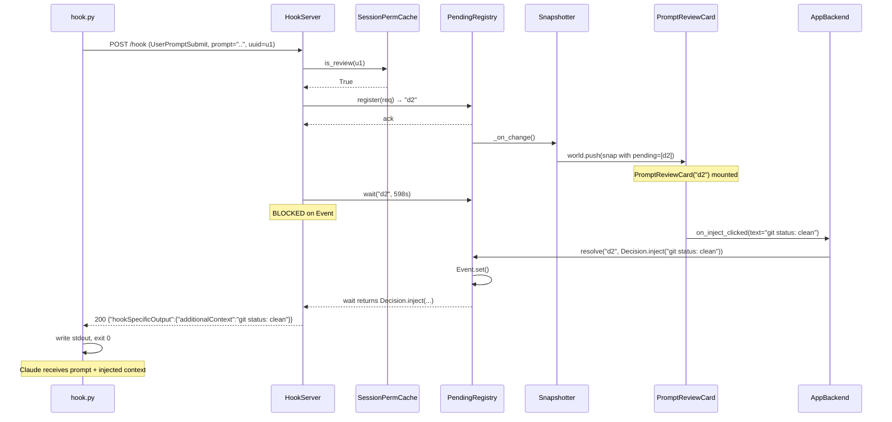

# Bidirectional Hook Protocol + Permission Approval UI + Turn-Complete Notifications

> **Status**: Overview Design — pending review.
> Once confirmed, Detail Design follows below the line.

---

## Part 1: Overview Design

### 1. Problem & Goals

#### Problem

claude-island today is a **read-only observer**: it watches Claude Code's JSONL transcripts, process state, and one-way hook events to *show* what's happening, but it cannot *act* on the agent. Three concrete pain points:

- **P1 — User must context-switch to terminal for every permission prompt.** Claude Code stops to ask "allow Bash to run `npm test`?" The user is reading the island; to approve, they must click into the terminal, find the prompt, type `y`. open-vibe-island lets the user click *Allow* directly on the island.
- **P2 — User has no idea when a long turn finishes.** Claude is "Thinking…" for 30s. The user switches tabs. There's no system notification when the turn completes; user has to keep peeking at the island or terminal.
- **P3 — Hook protocol is one-way.** `hook.py` POSTs to the listener and discards the response. Even though the *transport* (`urllib.request.urlopen`) reads the response body, the server always writes `{}`. This blocks every "island controls Claude" feature, not just permission approval.

#### Goals

| ID | Goal | How verified |
|----|------|--------------|
| **G1** | User can approve / deny `PreToolUse` from the island UI | Click "Allow" on a `PreToolUse` card → Claude proceeds with the tool. Click "Deny" → Claude reports the deny reason in transcript. |
| **G2** | User receives an OS-native notification when a turn completes | `Stop` hook fires → notification appears within 500 ms (p95) on both macOS and Windows. |
| **G3** | Hook server can return a JSON directive in the response body, with per-event timeout (fast events stay 5 s; blocking events extend to Claude Code's 600 s default) | New round-trip test: server holds response for N ms, hook stdout matches the directive. |
| **G4** | **Cross-platform parity (macOS + Windows).** No design decision may favor one OS to the exclusion of the other. | Both `pytest` test matrices green; manual verification on both OSes. |
| **G5** | Existing fail-open contract preserved: if the island is down or slow, Claude Code never hangs; hook exits 0 within hard cap. | Existing fail-open tests still pass; new test: kill listener mid-approval → hook exits within timeout. |
| **G6** | Approval UI round-trip latency < 200 ms (excluding user think time): from click to Claude resuming. | E2E test with mock hook + simulated click; measure click→resp time. |
| **G7** | **Session-scoped permission memory.** When user clicks "Allow" with checkbox "Remember for this session" set, future `PreToolUse` events for the same `(session_uuid, tool_name)` auto-allow without asking. Memory is in-process only; cleared on session end. | Test: tick checkbox, allow `Bash` once → next `Bash` call from same session passes through with no UI. |
| **G8** | **UserPromptSubmit interception (opt-in per session).** When the per-session "Review prompts" toggle is on, every `UserPromptSubmit` shows a card with Allow / Block (with reason) / Inject Context. When toggle is off (default), the hook auto-allows silently. | Test: enable toggle, type a prompt, see card; click "Inject Context" + type text → Claude receives prompt with extra context. |

#### Non-Goals

- **iOS / Apple Watch companion apps.** open-vibe-island has them; we don't, and adding them would force a Unix-socket / SSE protocol replacement. Out of scope.
- **Replacing TCP-localhost with Unix socket / named pipe.** The transport-layer change is decoupled from the user-visible feature; doing both at once doubles risk for no extra user value (see §3 alternatives).
- **Persistent (cross-session) "Allow Always" rules.** v1 ships in-memory session-scoped memory only (G7). A persistent rule engine writing to disk + revoke UI is a v2 feature; would otherwise reinvent Claude Code's `~/.claude/settings.json` permission rules.
- **Per-input granularity for session memory.** v1 grants by `(session_uuid, tool_name)` pair only — i.e. "trust this session's Bash" not "trust this session's `npm test`". Per-input matching adds a hashing scheme + UX surprise ("but I allowed `npm test`, why is it asking about `npm test --watch`?") that's not worth v1 complexity.
- **Modifying tool input on the fly** (e.g., editing a Bash command before it runs). Claude's `permissionDecision` JSON supports `updatedInput`; v1 UI is binary allow/deny only.
- **Modifying the user's prompt text** in `UserPromptSubmit`. Per Claude's spec, `UserPromptSubmit` directives support `additionalContext` injection but **not** prompt rewriting. v1 surfaces only what the spec allows: Allow / Block (with reason) / Inject Context.
- **Rich notification actions** (e.g., "Approve from notification banner"). v1 notification is informational only; clicking opens the island.
- **Throttling / batching of `PreToolUse` events** when the user has many sessions firing. v1 shows them in a list; if it gets noisy we'll add policy in v2.
- **Revoke UI for session-scoped memory.** v1 grants stick until session ends. v2 may add a "clear remembered tools" affordance in the session detail popup.

---

### 2. Solution Design

> Diagrams come before prose. Prose explains only what the diagrams cannot.

#### Architecture (C4 Context + Container, combined)

```
┌──────────────────────────┐                                 macOS / Windows
│  Claude Code subprocess  │      ┌──────────────────────────────────────────────────────────┐
│                          │      │                  claude-island app                       │
│   ┌──────────────────┐   │      │                                                          │
│   │ ~/.claude-island │   │ HTTP │  ┌─────────────────────┐                                 │
│   │   /hook.py       │ ──┼──────┼─►│ HookServer          │                                 │
│   │  (stdlib only)   │   │ POST │  │ ┌─────────────────┐ │                                 │
│   │                  │   │      │  │ │ fast events     │ │                                 │
│   │  blocks on resp  │◄──┼──────┼──│ │  → 200 OK {}    │ │                                 │
│   │  body, writes    │ JSON│    │  │ │ blocking events │ │                                 │
│   │  to stdout       │ resp│    │  │ │  → suspend resp │ │ register                        │
│   └──────────────────┘   │      │  │ │  → wait Event   │ │ ────►┐                          │
│                          │      │  │ └─────────────────┘ │      │                          │
└──────────────────────────┘      │  └─────────┬───────────┘      ▼                          │
                                  │            │  wake()  ┌──────────────────────────────┐  │
                                  │            ▼          │ PendingDecisionRegistry      │  │
                                  │  ┌───────────────────┐│ id → (Event, Result)         │  │
                                  │  │ Snapshotter       ││ TTL = hook_timeout - 2s      │  │
                                  │  │ (worker thread)   │└───────┬──────────────────────┘  │
                                  │  │ - includes        │        │                         │
                                  │  │   pending_decs    │        │                         │
                                  │  │   in WorldSnapshot│        │                         │
                                  │  └───────┬───────────┘        │                         │
                                  │          │ world.push(snap)   │                         │
                                  │          │  (Qt main thread)  │                         │
                                  │          ▼                    │                         │
                                  │   ┌─────────────────────────────────────────────────┐   │
                                  │   │ Existing Capsule + ExpandedPanel                │   │
                                  │   │   + new ApprovalCard (PreToolUse)               │   │
                                  │   │   + new PromptReviewCard (UserPromptSubmit)     │   │
                                  │   │   + new NotificationDispatcher                  │   │
                                  │   └────┬───────────────────────────┬──────────┬─────┘   │
                                  │        │ click Allow/Deny/         │          │         │
                                  │        │ Block/InjectContext       │          │         │
                                  │        │ (+ "remember in session"  │          │         │
                                  │        │   checkbox on Allow)      │          │         │
                                  │        ▼                           ▼          ▼         │
                                  │  ┌─────────────────────────┐  ┌─────────────────────┐   │
                                  │  │ AppBackend              │  │ NotifyBackend       │   │
                                  │  │  .resolve(id, decision) │  │  .post(title, body) │   │
                                  │  │  → if "remember":       │  │                     │   │
                                  │  │    SessionPermCache.add │  │ macOS: osascript    │   │
                                  │  │      (uuid, tool)       │  │        display      │   │
                                  │  │  → set Event            │  │        notification │   │
                                  │  └─────┬───────────────────┘  │ Win:   winrt toast  │   │
                                  │        │                      │   + QSystemTrayIcon │   │
                                  │        │ checked before       │   fallback          │   │
                                  │        │ HookServer suspends  └─────────────────────┘   │
                                  │        ▼                                                │
                                  │  ┌──────────────────────────────────────────────────┐   │
                                  │  │ SessionPermissionCache (in-memory, per-session)  │   │
                                  │  │  {(session_uuid, tool_name) → granted_at}        │   │
                                  │  │  TTL = until SessionEnd hook fires               │   │
                                  │  └──────────────────────────────────────────────────┘   │
                                  └──────────────────────────────────────────────────────────┘

Key design decisions (annotated on the diagram):
  ●  Bidirectional HTTP (not Unix socket) — chosen for cross-platform parity, minimum
     change. Hook process blocks on response body; server holds response until UI resolves.
  ●  PendingDecisionRegistry — single source of truth for pending approvals, included
     in WorldSnapshot so all UI surfaces render consistently and rebuild is one wake().
  ●  SessionPermissionCache — checked BEFORE registering a PendingDecision. Hit → server
     auto-replies "allow" without UI. Miss → user prompted; if "remember" ticked, cache
     update happens at the same Event.set() point. In-memory only; SessionEnd evicts.
  ●  PromptReviewCard / UserPromptSubmit — fast-path silent allow when per-session
     "Review prompts" toggle is OFF (default). Toggle ON → every prompt blocks for review.
     Toggle state stored in SessionPermissionCache alongside grants.
  ●  NotifyBackend — Protocol at the platform_ layer; macOS + Windows implementations
     injected at __main__. Mirrors existing OsBackend / TerminalAdapter pattern.
```

#### Core flow — `PreToolUse` with user approval

```
Claude Code        hook.py          HookServer           PendingDecRegistry      UI (Qt)            User
    │                 │                 │                       │                  │                 │
    │ spawn hook,     │                 │                       │                  │                 │
    │ pipe stdin/out  │                 │                       │                  │                 │
    ├────────────────►│                 │                       │                  │                 │
    │                 │ POST /hook      │                       │                  │                 │
    │                 │ (PreToolUse)    │                       │                  │                 │
    │                 ├────────────────►│                       │                  │                 │
    │                 │                 │ register(id, Event)   │                  │                 │
    │                 │                 ├──────────────────────►│                  │                 │
    │                 │                 │ snapshotter.wake()    │                  │                 │
    │                 │                 │                       │  WorldSnapshot   │                 │
    │                 │                 │                       │  with pending=[…]│                 │
    │                 │                 │                       ├─────────────────►│                 │
    │                 │                 │                       │                  │ render          │
    │                 │                 │                       │                  │ ApprovalCard    │
    │                 │                 │                       │                  │                 │
    │                 │                 │ Event.wait(600s)      │                  │ click "Allow"   │
    │                 │                 │                       │                  │◄────────────────┤
    │                 │                 │                       │ resolve(id, allow)│                │
    │                 │                 │                       │◄─────────────────┤                 │
    │                 │                 │  ◄── unblocked ───────┤                  │                 │
    │                 │ 200 OK + JSON   │                       │                  │                 │
    │                 │ {permissionDec  │                       │                  │                 │
    │                 │  ision: allow}  │                       │                  │                 │
    │                 │◄────────────────┤                       │                  │                 │
    │ stdout JSON     │                 │                       │                  │                 │
    │◄────────────────┤                 │                       │                  │                 │
    │ tool runs       │ exit 0          │                       │                  │                 │
```

#### Edge flow — user did not act within timeout (fail-open)

```
hook.py          HookServer           UI                  Claude Code
   │                 │                 │                       │
   │ POST            │                 │                       │
   ├────────────────►│                 │                       │
   │ (5s POST timeout│ register +      │                       │
   │  on hook side)  │ Event.wait(N)   │                       │
   │                 │ where N = 598s  │                       │
   │ ░░ blocks ░░    │ ░░ blocks ░░    │ user idle             │
   │                 │                 │                       │
   │ POST timeout    │                 │                       │
   │ (hook-side 600s)│                 │                       │
   │ → fall back to  │                 │                       │
   │ stdout "{}" — fail-open contract  │                       │
   ├──────────────── stdout {} ──────────────────────────────►│
   │ exit 0          │ at 598s, server │                       │ no permissionDecision
   │                 │ writes "{permis-│                       │ → Claude defers to its
   │                 │ sionDecision:   │                       │   own permission rules
   │                 │ defer}" but     │                       │   (typically prompts in
   │                 │ socket already  │                       │   terminal, like today)
   │                 │ closed → log    │                       │
   │                 │ orphan, drop    │                       │
   │                 │ pending entry   │                       │
```

#### Edge flow — turn complete (`Stop` hook) → OS notification

```
Claude Code → hook.py → POST /hook (Stop) → HookServer
                                                  │
                                                  │ fast event:
                                                  │ - emit "{}" immediately (don't block)
                                                  │ - hand event to Snapshotter
                                                  ▼
                                         Snapshotter.wake()
                                                  │
                                                  │ WorldSnapshot.events
                                                  │   += TurnCompleted(session_uuid, ts)
                                                  ▼
                                       NotificationDispatcher (Qt main thread, subscribed)
                                                  │
                                                  │ check rules:
                                                  │ ✗ session is silenced  → drop
                                                  │ ✗ user-frontmost == this session's terminal → drop
                                                  │ ✗ within debounce window (3s) → drop
                                                  │ ✓ otherwise → backend.post()
                                                  ▼
                                         macOS: osascript display notification
                                         Win:   winrt ToastNotifier (or QSystemTrayIcon fallback)
```

---

### 3. Research & Comparison

> *Web search performed: Claude Code hook spec ([code.claude.com/docs/en/hooks](https://code.claude.com/docs/en/hooks)), open-vibe-island BridgeServer/Transport source, current claude-island hook.py.*

**Key external constraints:**
- Claude Code's `PreToolUse` hook expects `permissionDecision` in the JSON written to **stdout**. Default command-hook timeout is **600 s** — generous enough for human approval.
- Hook process is invoked as a fresh subprocess per event. Long-lived connections aren't possible at the hook layer; only the *server side* gets to persist state.
- Claude Code hook script must be **stdlib-only** to keep cold-start <200 ms (claude-island's existing budget).

#### Three transport options considered

| Dimension | **A. HTTP request-response (chosen)** | B. Unix socket + JSON-RPC (open-vibe-island) | C. HTTP + WebSocket hybrid |
|-----------|---------------------------------------|----------------------------------------------|---------------------------|
| **Cross-platform parity (G4)** | ✓ identical on macOS / Windows | ⚠ AF_UNIX on Win10+ inconsistent; need named-pipe abstraction | ✓ HTTP same; WS lib same |
| **Change blast radius** | small — `hook.py` already reads response body, just extend timeout + add server logic | **large** — replace entire transport, IPC abstraction layer, both sides rewrite | medium — HTTP unchanged + new WS path |
| **Hook process complexity** | unchanged: stdlib `urllib.request` already does request-response | **higher**: stdlib has no Unix-socket HTTP client; need raw socket framing in hook.py | unchanged for hook (still HTTP) |
| **Future iOS / push channel** | needs new transport added later | already there | clean — WS exists for it |
| **Concurrency / scale** | sufficient (≤10 concurrent approvals expected) | better (single connection, multiplexed) | better |
| **Time to ship** | ~1 week | ~3 weeks | ~2 weeks |
| **Existing code reuse** | high | low (replaces working server) | medium |

**Why A wins for v1:**
- Transport is **already half-bidirectional** in claude-island (`hook.py:180` reads `resp.read()`, writes to stdout). The only change needed on the wire is "server writes meaningful body" + "hook tolerates longer timeout for blocking events".
- G4 cross-platform parity is satisfied for free with HTTP. Unix socket on Windows requires either named-pipe path (different API) or AF_UNIX (Win10+, but no stdlib HTTP client supports it) — adds a `Transport` abstraction layer with two implementations for zero user-visible benefit in v1.
- The two user-visible features (G1 approval UI, G2 notifications) are 90% UI and state-machine work; transport choice barely affects them.
- C (WebSocket) is the right next step *if* we add an iOS app. Until then, the HTTP path leaves room: `/events` SSE endpoint can be added in parallel without touching the hook protocol.

#### Risks of the chosen solution

**Type A — cost of choosing (the trade-offs accepted):**

| Risk | Impact | Mitigation |
|------|--------|------------|
| No SSE / push channel out of the box | Future iOS app needs separate transport addition (~1 week extra work) | Keep `HookServer` modular so a parallel `EventStreamServer` (SSE / WS) can mount on the same TCP port later. |
| HTTP per event has ~1-3 ms overhead vs Unix socket | Negligible at expected event rates (10-100/min); imperceptible to users | None needed at v1 scale; revisit if observed > 1000/min. |
| Server thread per blocking approval (one OS thread held for up to 600 s) | Thread pool exhaustion if user accumulates many pending approvals (~10s of OS threads) | Cap `MAX_PENDING_DECISIONS = 16`; beyond cap, server replies `{"permissionDecision": "defer"}` so Claude falls back to its own permission rule. Log warning. |

**Type B — intrinsic fragility (regardless of alternative):**

| Risk | Impact | Mitigation |
|------|--------|------------|
| User clicks "Allow" *after* hook timeout — server has already orphaned the entry | UI shows "Allow" succeeded but Claude already proceeded with terminal prompt | UI shows "expired" state on cards whose `expires_at` is past; resolve attempt logs warning, returns False to UI. |
| Notification spam (e.g., one user starts 5 sessions, all stop at once) | User annoyed | Debounce: drop notifications within 3 s of last per-session; coalesce N≥3 simultaneous Stops into one "X turns finished" notification. |
| `Stop` hook fires for a turn the user is actively watching | Pointless notification | Suppress when (a) island is frontmost, (b) the session's owning terminal is frontmost (reuse existing `find_ui_app_ancestor` for OS detection). |
| macOS `osascript display notification` is rate-limited by NotificationCenter (~1 per 2 s for unbundled apps) | Some notifications swallowed | This is a v1 limitation; documented. Path to bundled .app + `UNUserNotificationCenter` is in scope for v2 (depends on packaging story). |
| Windows `winrt` toast requires `winsdk` or `PyToastNotifier`, both add a dependency | Bigger Windows deps | If `winrt` import fails, fall back to `QSystemTrayIcon.showMessage` (Qt built-in, no extra dep). |
| Hook protocol version bump (v3 → v4) breaks user's stale `~/.claude-island/hook.py` if app updates without re-running install | Stale hook keeps working with `{}` body — graceful degradation, but new features unavailable | `hook_installer.sync_hook_script` already version-syncs on app boot; existing mechanism covers this. |
| **G7 risk** — session-scoped permission memory on stale `session_uuid`. If our `SessionEnd` detection misses (hook never fires, e.g. crashed claude.exe), grants linger until process restart. | User thinks `Bash` was re-locked, but next time same uuid resurrects it auto-allows | Attach a hard TTL of 4 hours per grant in addition to `SessionEnd` eviction. Expired grants are dropped silently — user re-prompted on next use. |
| **G7 risk** — `(session_uuid, tool_name)` granularity is coarse. User trusts `Bash` once for `npm test`; later turn issues `rm -rf` with same uuid+tool → auto-allowed. | User foot-gun | v1: card prominently warns "Remembering will allow ALL Bash calls in this session"; risky tools (`Bash`, `Write`, `Edit`) show the warning, low-risk (`Read`, `Glob`) hide it. v2 considers per-input matching. |
| **G8 risk** — `UserPromptSubmit` interception ON by default would intercept every `hello` → annoying. | Users disable feature entirely after first frustrating session | Default: toggle OFF per session. The toggle is one click in the session detail popup; off until explicitly enabled. Toggle state is per-session and doesn't persist across restarts (matches the in-memory `SessionPermissionCache` lifecycle). |
| **G8 risk** — `Stop` notification might fire while the user is mid-prompt-review on the same session. | Notification claims turn done but user hasn't approved a prompt yet | The `Stop` hook fires only after Claude *responds* — by then any blocking `UserPromptSubmit` has already resolved (Allow was clicked, prompt went through, Claude responded). No race. Documented as invariant. |

---

### 4. Decisions (was: Open Questions)

| # | Question | Decision |
|---|---|---|
| 1 | macOS notification backend? | **`osascript display notification` for v1.** No packaging blocker. Bundled `.app` + `UNUserNotificationCenter` deferred until packaging is on the roadmap. Rate-limit acceptable for v1 user volumes. |
| 2 | ApprovalCard layout when multiple pending? | **Vertical list, max 5 visible, scroll for more.** Each card resolves independently. Honest representation of system state. |
| 3 | "Allow Always" / permission memory in v1? | **In-memory, session-scoped only (G7).** Per-`(session_uuid, tool_name)` grant. No disk persistence. No revoke UI in v1. Risky tools show prominent warning on the "remember" checkbox. |
| 4 | UserPromptSubmit interception in v1? | **In, but opt-in per session (G8).** Default OFF. Per-session toggle in detail popup. When ON: card with Allow / Block (with reason) / Inject Context. Prompt rewriting NOT supported (per Claude's spec). |

---

### 5. Scope summary after decisions

**Surface area shipped in v1:**
- HookServer: bidirectional response body, per-event timeout (5 s fast / 600 s blocking)
- PendingDecisionRegistry (with `MAX_PENDING_DECISIONS = 16` cap)
- SessionPermissionCache (in-memory, evicted on SessionEnd or 4 h TTL)
- ApprovalCard (PreToolUse — list, max 5 visible)
- PromptReviewCard (UserPromptSubmit — only when per-session toggle ON)
- "Review prompts" toggle in session detail popup
- NotificationDispatcher with debounce, suppress-on-frontmost, coalesce
- NotifyBackend Protocol + macOS (osascript) + Windows (winrt → QSystemTrayIcon fallback) implementations

**Estimated effort: ~1.5–2 weeks** (bumped from 1 week in original Overview to account for SessionPermissionCache + UserPromptSubmit card + per-session toggle persistence layer).

**Hook protocol bump: v3 → v4** (covers blocking-event timeout extension, response-body directive contract, `Stop` event registration).

---

> Overview confirmed 2026-05-14. Detail Design follows.

---

## Part 2: Detail Design

> Each section below traces back to a Goal/Flow/Decision in the Overview. Existing-module
> changes are signature-only; new-module contracts are full.

### 1. Module Responsibilities & Interfaces

Six new modules + four modified. Component diagram first, then per-component contracts.

#### Component diagram (C4 Component, layered)

```
┌─────────────────────────────────────────────────────────────────────────┐
│ core/                                                                   │
│  ┌─────────────────────────┐    ┌──────────────────────────────────┐    │
│  │ pending_decisions.py    │    │ session_permissions.py           │    │
│  │ (NEW)                   │    │ (NEW)                            │    │
│  │  PendingDecisionRegistry│    │  SessionPermissionCache          │    │
│  │  ├ register / resolve   │    │  ├ check / grant / evict_session │    │
│  │  ├ wait / snapshot      │    │  ├ is_review / set_review        │    │
│  │  └ evict_expired        │    │  └ evict_expired (4 h TTL)       │    │
│  └────────┬────────────────┘    └────────────┬─────────────────────┘    │
│           │ snapshot()                       │ check()                  │
│           ▼                                  ▼                          │
│  ┌─────────────────────────────────────────────────────────────────┐    │
│  │ snapshot.py (MOD)                                                │    │
│  │  WorldSnapshot                                                   │    │
│  │   + pending_decisions: tuple[PendingDecisionView, ...]           │    │
│  │   + notify_events:     tuple[NotifyEvent, ...]                   │    │
│  └─────────────────────────────────────────────────────────────────┘    │
│                                                                          │
│  ┌─────────────────────────┐    ┌──────────────────────────────────┐    │
│  │ notify.py (NEW)         │    │ hook_events.py (MOD)             │    │
│  │  NotifyEvent            │    │  + PreToolUseEvent (parsed)      │    │
│  │  NotifyKind             │    │  + UserPromptSubmitEvent         │    │
│  │  NotifyDispatchPolicy   │    │  + StopEvent  (TurnComplete src) │    │
│  │  (pure rule eval)       │    │  + SessionEndEvent (cache evict) │    │
│  └─────────────────────────┘    └──────────────────────────────────┘    │
└─────────────────────────────────────────────────────────────────────────┘
                                          │
┌─────────────────────────────────────────┼──────────────────────────────┐
│ platform_/                              ▼                              │
│  ┌────────────────────────────────────────────────────────────────┐    │
│  │ hook_server.py (MOD)                                           │    │
│  │  HookServer                                                    │    │
│  │   ├ per-event timeout dispatch                                 │    │
│  │   ├ cache pre-check before register                            │    │
│  │   ├ blocking-handler thread pool (cap = 16)                    │    │
│  │   └ writes Directive in HTTP response body                     │    │
│  └────────────────────────────────────────────────────────────────┘    │
│                                                                         │
│  ┌────────────────────────────────────────────────────────────────┐    │
│  │ hook_session_bridge.py (MOD)                                   │    │
│  │  routes new events into SessionPermissionCache eviction +      │    │
│  │  WorldSnapshot.notify_events queue                             │    │
│  └────────────────────────────────────────────────────────────────┘    │
│                                                                         │
│  ┌─────────────────────────┐    ┌──────────────────────────────────┐   │
│  │ notify/protocols.py(NEW)│    │ notify/macos.py + windows.py +   │   │
│  │  NotifyBackend Protocol │◄───│ noop.py  (NEW)                   │   │
│  │  .post(title, body, k)  │    │  osascript / winrt → tray / noop │   │
│  └─────────────────────────┘    └──────────────────────────────────┘   │
└────────────────────────────────────────────────────────────────────────┘
                                          │
┌─────────────────────────────────────────┼──────────────────────────────┐
│ ui/                                     ▼                              │
│  ┌─────────────────────────┐    ┌──────────────────────────────────┐   │
│  │ approval_card.py (NEW)  │    │ prompt_review_card.py (NEW)      │   │
│  │  ApprovalCard widget    │    │  PromptReviewCard widget         │   │
│  │  Allow/Deny + remember  │    │  Allow / Block(reason) / Inject  │   │
│  └────────┬────────────────┘    └────────┬─────────────────────────┘   │
│           │ on_resolve(id, decision)      │ on_resolve(id, decision)   │
│           ▼                               ▼                            │
│  ┌────────────────────────────────────────────────────────────────┐    │
│  │ notification_dispatcher.py (NEW)                                │    │
│  │  NotificationDispatcher (Qt main thread)                        │    │
│  │  subscribed to world.observable(); applies NotifyDispatchPolicy │    │
│  │  drives NotifyBackend.post()                                    │    │
│  └────────────────────────────────────────────────────────────────┘    │
│                                                                         │
│  ┌─────────────────────────┐    ┌──────────────────────────────────┐   │
│  │ expanded_window.py (MOD)│    │ session_detail_popup (MOD)       │   │
│  │  mounts ApprovalCardList│    │  + "Review prompts" toggle       │   │
│  │  + PromptReviewCardList │    │    → SessionPermissionCache.     │   │
│  └─────────────────────────┘    │      set_review(uuid, on)        │   │
│                                 └──────────────────────────────────┘   │
└────────────────────────────────────────────────────────────────────────┘
```

#### Per-component contracts (new modules — full; modified — signature-only)

**`core/pending_decisions.py` (NEW)**

```
PendingDecisionRegistry.register(req: DecisionRequest) -> str
  pre:    len(_decisions) < MAX_PENDING_DECISIONS (=16)
  returns: decision id (uuid4 hex)
  errors: RegistryFull when at cap
  side fx: triggers _on_change() callback (caller wires snapshotter.wake)

PendingDecisionRegistry.resolve(id: str, decision: Decision) -> bool
  pre:    none (id may be unknown)
  returns: True if id existed and was resolved this call;
          False if not found, already resolved, or expired
  side fx: sets internal Event; triggers _on_change()

PendingDecisionRegistry.wait(id: str, timeout_s: float) -> Decision | None
  pre:    id was register()'d
  returns: resolved Decision, or None on timeout
  side fx: blocks calling thread; on timeout drops the entry

PendingDecisionRegistry.snapshot() -> tuple[PendingDecisionView, ...]
  pre:    none
  returns: immutable per-tick snapshot (sorted by created_at asc),
          for inclusion in WorldSnapshot

PendingDecisionRegistry.evict_expired() -> int
  pre:    none
  returns: count of entries dropped (TTL exceeded)
  side fx: triggers _on_change() if any dropped
```

**`core/session_permissions.py` (NEW)**

```
SessionPermissionCache.check(uuid: str, tool_name: str) -> bool
  pre:    none
  returns: True iff a non-expired grant exists for (uuid, tool_name)

SessionPermissionCache.grant(uuid: str, tool_name: str) -> None
  pre:    none
  side fx: insert (uuid, tool_name) → now() with 4 h hard TTL

SessionPermissionCache.evict_session(uuid: str) -> int
  pre:    none
  returns: count of grants + review-mode entries dropped for uuid

SessionPermissionCache.evict_expired() -> int
  pre:    none
  returns: count of grants dropped past 4 h TTL

SessionPermissionCache.is_review(uuid: str) -> bool
  pre:    none
  returns: True iff per-session "Review prompts" toggle was enabled

SessionPermissionCache.set_review(uuid: str, enabled: bool) -> None
  pre:    none
  side fx: stores per-session toggle state (in-memory only)
```

**`core/notify.py` (NEW — pure policy, no Qt/OS)**

```
NotifyDispatchPolicy.evaluate(
    event: NotifyEvent,
    *, recent: Sequence[DispatchRecord], frontmost: FrontmostInfo,
) -> DispatchDecision
  pre:    none
  returns: DispatchDecision.suppress(reason) | .single | .coalesce(n)
  pure:   no side effects; tested with table-driven inputs
```

**`platform_/notify/protocols.py` (NEW)**

```
NotifyBackend.post(*, title: str, body: str, kind: NotifyKind = INFO) -> bool
  pre:    title and body are valid utf-8; len(title) ≤ 80, len(body) ≤ 200
  returns: True iff backend reports success (best-effort)
  errors: never raises — backend swallows failures, returns False
```

**`platform_/notify/macos.py`, `windows.py`, `noop.py` (NEW)**
Each implements the Protocol; selection lives in `__main__.py` per `sys.platform`.

**`ui/approval_card.py` (NEW)** — see Section 2 for `PendingDecisionView` shape.

```
ApprovalCard(view: PendingDecisionView, *, on_resolve: ResolveCallback)
  emits on_resolve(view.id, Decision.allow(remember=bool)) on Allow click
  emits on_resolve(view.id, Decision.deny(reason)) on Deny click
  shows "remember in session" checkbox; for risky tools (Bash/Write/Edit),
  checkbox shows red warning label
```

**`ui/prompt_review_card.py` (NEW)**

```
PromptReviewCard(view: PendingDecisionView, *, on_resolve: ResolveCallback)
  Allow            → on_resolve(id, Decision.allow())
  Block(reason)    → on_resolve(id, Decision.block(reason))
  Inject(context)  → on_resolve(id, Decision.inject(context))
  Prompt text shown read-only (per Non-Goals: no rewrite).
```

**`ui/notification_dispatcher.py` (NEW)**

```
NotificationDispatcher(*, backend: NotifyBackend, policy: NotifyDispatchPolicy)
  subscribes to world.observable() with distinct_until_changed on
    s.notify_events_render_key(); on each new event, applies policy +
    backend.post(); maintains _dispatched_ids set + _last_per_session for
    debounce. Runs on Qt main thread.
```

**Modified contracts (signature-only)**

```
HookServer.handle(request) -> HTTP response   # now suspends + writes body
hook_session_bridge.HookSessionBridge.on_event(parsed)  # routes new events
WorldSnapshot                                  # see Section 2
AppBackend.resolve_decision(id, decision) -> bool  # NEW capability
```

---

### 2. Data Model / Schema

All immutable `frozen=True, slots=True` dataclasses (matches existing `SessionView`
discipline — keeps `distinct_until_changed` cheap).

#### Decision request / response

```
@dataclass(frozen=True, slots=True)
class DecisionRequest:
  id:             str          # uuid4 hex
  kind:           DecisionKind # PRE_TOOL_USE | USER_PROMPT_SUBMIT
  session_uuid:   str
  hook_event:    str           # "PreToolUse" | "UserPromptSubmit"
  tool_name:     str | None    # set ⇔ kind == PRE_TOOL_USE
  tool_input:    dict[str,Any] # raw, used for preview generation
  prompt:        str | None    # set ⇔ kind == USER_PROMPT_SUBMIT
  cwd:           Path
  created_at:    datetime
  expires_at:    datetime      # = created_at + (timeout - 2 s safety)

invariant: kind == PRE_TOOL_USE       ⇒ tool_name is not None
invariant: kind == USER_PROMPT_SUBMIT ⇒ prompt is not None
invariant: expires_at > created_at

@dataclass(frozen=True, slots=True)
class Decision:
  kind:               DecisionResultKind  # ALLOW | DENY | BLOCK | INJECT
  reason:             str | None          # required when DENY/BLOCK
  additional_context: str | None          # required when INJECT
  remember:           bool = False        # only meaningful when ALLOW + PRE_TOOL_USE

invariant: kind in (DENY, BLOCK) ⇒ reason is non-empty
invariant: kind == INJECT        ⇒ additional_context is non-empty
invariant: remember ⇒ kind == ALLOW

# Render-side projection. Kept separate from DecisionRequest because:
#  (a) tool_input may be very large; UI never needs it raw
#  (b) we never want secrets (env vars in Bash) leaking into the snapshot
@dataclass(frozen=True, slots=True)
class PendingDecisionView:
  id:                  str
  kind:                DecisionKind
  session_uuid:        str
  session_name:        str          # already resolved; UI never re-resolves
  tool_name:           str | None
  tool_input_preview:  str          # ≤ 300 chars, shell-escaped + truncated
  prompt_preview:      str | None   # ≤ 500 chars, truncated mid
  cwd_basename:        str
  risk_level:          RiskLevel    # LOW | MEDIUM | HIGH; drives card color
  expires_at:          datetime
```

#### Session permission cache

```
@dataclass(frozen=True, slots=True)
class SessionPermissionGrant:
  session_uuid: str
  tool_name:    str
  granted_at:   datetime
  expires_at:   datetime           # = granted_at + 4 h hard TTL

internal storage:
  _grants:        dict[(uuid, tool_name), SessionPermissionGrant]
  _review_modes:  dict[uuid, bool]   # default False on missing key
constraint: at most one grant per (uuid, tool_name) — newer overwrites
```

#### Notification

```
@dataclass(frozen=True, slots=True)
class NotifyEvent:
  id:           str          # uuid4 hex; deduplication key
  kind:         NotifyKind   # TURN_COMPLETE | TURN_FAILED
  session_uuid: str
  session_name: str          # cached; UI never re-resolves
  cwd_basename: str
  occurred_at:  datetime
```

#### WorldSnapshot additions

```
WorldSnapshot.pending_decisions: tuple[PendingDecisionView, ...]  # sorted by created_at
WorldSnapshot.notify_events:     tuple[NotifyEvent, ...]          # rolling window: last 60 s

render_key():  ... | tuple(d.id for d in pending_decisions) | tuple(e.id for e in notify_events)
```

`notify_events` is a **rolling window** (not consumed-and-cleared): events stay 60 s
so a brief snapshot rebuild can't drop a notification mid-flight. Dispatcher dedups
via `_dispatched_ids` set on its own side. Justification in §3 state machine.

---

### 3. Core Algorithms / State Machines

#### PendingDecision lifecycle

```
       register
   ──────────────►  PENDING ──── resolve(decision) ────► RESOLVED
                       │              │                      │
                       │              │ Event.set()          │ server thread
                       │              │                      │ wakes from wait,
                       │              │                      │ writes JSON body
                       │              │                      ▼
                       │              │                  DELIVERED
                       │              │
                       │              ▼ (resolve arrived after wait timeout)
                       │           ORPHANED  (logged warning; no effect on Claude
                       │                      because hook already exited fail-open)
                       │
                       │ wait() timeout
                       ▼
                    EXPIRED ──── snapshotter.wake() ────► dropped from WorldSnapshot
                                  next rebuild              UI card disappears

invariant: from PENDING exactly one of {RESOLVED, EXPIRED} is reached
invariant: state transitions are atomic via threading.Event + dict-lock
```

#### NotifyDispatchPolicy decision tree

```mermaid
flowchart TD
    Start[NotifyEvent received in WorldSnapshot] --> A{event.id in<br/>_dispatched_ids?}
    A -->|yes| Drop1[Drop: already delivered]
    A -->|no| B{last dispatch for<br/>this session<br/>within 3 s?}
    B -->|yes| Drop2[Drop: debounced]
    B -->|no| C{island frontmost<br/>or session terminal<br/>frontmost?}
    C -->|yes| Drop3[Drop: user is watching]
    C -->|no| D{≥3 unprocessed<br/>events in last<br/>5 s window?}
    D -->|yes| Coal[Post: 'N turns finished'<br/>mark all N as dispatched]
    D -->|no| Single[Post: '{name}: turn complete']
    Coal --> End[backend.post]
    Single --> End
```

**Why a rolling window in `WorldSnapshot.notify_events` instead of consume-and-clear:**
A snapshot rebuild can race with NotifyDispatcher (worker thread builds N+1 while Qt
is rendering N). With consume-and-clear, an event arriving in build N could be lost
when build N+1 sees the registry already empty (the dispatcher hasn't yet reached
it). Rolling window is idempotent — dispatcher dedups via `_dispatched_ids`, so
re-presenting the same event is harmless and safer.

#### Frontmost detection (cross-platform via existing helpers)

- macOS: reuse `platform_/terminals/_macos_common.find_ui_app_ancestor(pid)` to
  resolve the frontmost UI app; compare against the session's terminal pid.
- Windows: `win32gui.GetForegroundWindow()` + `GetWindowThreadProcessId()` walk.
- Both return `None`/0 on failure → treat as "not frontmost" (don't suppress).

---

### 4. Error Handling

| Call | Failure mode | Handling | Caller observes |
|------|--------------|----------|-----------------|
| `hook.py` POST | listener absent / refused | `urllib.error.URLError` → write `{}` to stdout, `exit 0` | Claude defers to `~/.claude/settings.json` permission rules (today's behavior) |
| `hook.py` POST | listener slow > hook timeout | hook hits its own timeout (set to `server_wait + 2 s`) → write `{}`, exit 0 | Same as above. Server side may still resolve later; logged as orphan. |
| `HookServer.wait` | `Event.wait` timeout | log orphan, write `{"permissionDecision":"defer"}` to socket (best effort), evict pending entry | Claude defers (terminal prompt). User sees no UI artefact (card auto-removed at expiry). |
| `HookServer` | request body > 1 MB | reject 413; hook fails-open `{}` | Claude defaults |
| `HookServer.register` | `RegistryFull` (cap = 16) | reply immediately `{"permissionDecision":"defer"}`, log warning with current pending list | Claude defaults; user manages pending UI to free slots |
| `NotifyBackend.post` (osascript) | osascript not on PATH / permission denied | `subprocess.run` returns non-zero → log once per process, return `False` | NotificationDispatcher records failure; subsequent events also drop silently |
| `NotifyBackend.post` (winrt) | `winrt` ImportError | fall back to `QSystemTrayIcon.showMessage` (ensures `WindowsNotifyBackend.post` returns True) | User gets tray notification instead of native toast — degraded but functional |
| `NotifyBackend.post` (tray fallback) | no system tray on Linux/headless | log once per process, return `False` | Notification dropped; documented limitation |
| `WorldMarshaler` | exception in subscriber | existing handling: log + skip render | UI not updated this tick — no regression to existing path |
| Cache lookup | lock contention | `threading.Lock` on dict — uncontended fast path; worst case ~µs | Negligible |

**Key principle:** every failure path preserves G5 fail-open. The hook process never
exits non-zero; the island never blocks Claude indefinitely.

---

### 5. Implementation Flows

Five flows. ASCII for linear, Mermaid for branching.

#### Flow A — `PreToolUse` cache hit (FAST PATH, no UI)

```
hook.py.run()                                                    [hook subprocess]
  └─ POST http://127.0.0.1:<port>/hook  (PreToolUse JSON)
       └─ HookServer.handle(req)                                 [server thread]
            ├─ HookEventParser.parse(body)
            │    → ParsedEvent(PRE_TOOL_USE, uuid="u1", tool_name="Bash", ...)
            ├─ session_perm_cache.check("u1", "Bash") → True
            └─ HTTP 200 + body =
                 {"hookSpecificOutput":
                    {"hookEventName":"PreToolUse",
                     "permissionDecision":"allow",
                     "permissionDecisionReason":"cached for this session"}}
                                                                 [<50 ms total]
  ↑ stdout = body, exit 0
↑ Claude proceeds with tool call
```

#### Flow B — `PreToolUse` cache miss → user approves with "remember"

```
hook.py.run()                                                    [hook subprocess]
  └─ POST /hook (PreToolUse JSON, hook timeout = 600 s)
       └─ HookServer.handle(req)                                 [server thread]
            ├─ HookEventParser.parse(body)
            ├─ session_perm_cache.check("u1", "Bash") → False
            ├─ pending_registry.register(DecisionRequest(...))
            │    ├─ if RegistryFull → return defer (handled per §4)
            │    └─ snapshotter.wake()
            │         └─ Snapshotter rebuilds WorldSnapshot      [worker thread]
            │              ├─ pending_decisions = registry.snapshot()
            │              └─ world.push(snap) via WorldMarshaler→[Qt main thread]
            │                   └─ ExpandedWindow.render(snap)
            │                        └─ ApprovalCardList.update(pending_decisions)
            │                             └─ ApprovalCard("d1") mounted, visible
            ├─ pending_registry.wait("d1", timeout_s = 598)      [server thread BLOCKS]
            │
            │  [USER CLICKS "Allow" with "remember in session" ticked]
            │       │
            │       └─ ApprovalCard.on_allow_clicked(remember=True)  [Qt thread]
            │            └─ AppBackend.resolve_decision(
            │                 "d1", Decision.allow(remember=True))
            │                 ├─ if remember: session_perm_cache.grant("u1","Bash")
            │                 └─ pending_registry.resolve("d1", decision)
            │                      └─ Event.set()                [unblocks server]
            │
            ├─ wait returns Decision.allow(remember=True)        [server resumes]
            ├─ encode → {"hookSpecificOutput":{"permissionDecision":"allow"}}
            └─ HTTP 200 + body
  ↑ hook reads body, writes stdout, exit 0
↑ Claude proceeds with tool call
```

#### Flow C — `Stop` event → notification

```
hook.py.run()                                                    [hook subprocess]
  └─ POST /hook (Stop JSON, hook timeout = 5 s)
       └─ HookServer.handle(req)                                 [server thread]
            ├─ HookEventParser.parse(body) → ParsedEvent(STOP, "u1", ...)
            ├─ HTTP 200 + body = "{}\n"  (immediate, non-blocking)
            └─ hook_session_bridge.on_stop(parsed)
                 ├─ append NotifyEvent(TURN_COMPLETE, "u1") to events queue
                 └─ snapshotter.wake()
                      └─ Snapshotter rebuilds WorldSnapshot      [worker thread]
                           ├─ notify_events = events_queue.snapshot_60s()
                           └─ world.push(snap)                   [Qt main thread]
                                └─ NotificationDispatcher.on_snapshot(snap)
                                     └─ for evt in snap.notify_events:
                                          if evt.id ∉ _dispatched_ids:
                                            policy = NotifyDispatchPolicy.evaluate(...)
                                            if policy.is_post:
                                              backend.post(title, body)
                                              _dispatched_ids.add(evt.id)
                                              _last_per_session[uuid] = now
```

#### Flow D — `UserPromptSubmit` (toggle OFF, default)

```
hook.py.run()                                                    [hook subprocess]
  └─ POST /hook (UserPromptSubmit JSON, hook timeout = 5 s)
       └─ HookServer.handle(req)                                 [server thread]
            ├─ HookEventParser.parse(body) → ParsedEvent(USER_PROMPT_SUBMIT, "u1")
            ├─ session_perm_cache.is_review("u1") → False
            └─ HTTP 200 + body = "{}\n"  (immediate)
  ↑ hook stdout, exit 0
↑ Claude proceeds with prompt
```

#### Flow E — `UserPromptSubmit` (toggle ON) → user injects context



#### Flow F — `SessionEnd` → cache eviction

```
hook.py.run() — POST /hook (SessionEnd, uuid=u1)
  └─ HookServer.handle: respond {} immediately
       └─ hook_session_bridge.on_session_end(parsed)
            ├─ session_perm_cache.evict_session("u1")
            │    → drops all (u1, *) grants + u1 review_mode entry
            └─ snapshotter.wake()  (so any UI showing u1 grants updates)
```

---

### 6. Performance Estimation

#### G6 — approval click → Claude resume p95 < 200 ms

```
target: p95 < 200 ms (G6)
input:  localhost TCP, ≤16 concurrent pending, single user

ApprovalCard click → Qt slot           ~1 ms     thread queue dispatch
AppBackend.resolve_decision            ~0.5 ms   acquire dict lock (uncontended)
PendingDecisionRegistry.resolve         ~0.3 ms   set Event + dict update
threading.Event.wait → returns          ~0.5 ms   futex wakeup
JSON encode Directive                   ~0.2 ms   ~150-byte payload
HTTP response write to socket           ~1 ms     localhost loopback
hook.py urllib reads body               ~5 ms    syscall + parse
hook.py stdout flush + exit             ~5 ms    pipe write
==========================================
total                                  ~13 ms    25× under budget

bottleneck: hook.py → claude.exe pipe (varies with OS scheduler);
           connection pool: 16 concurrent OK at default OS limits
```

#### G2 — Stop hook → notification posted p95 < 500 ms

```
target: p95 < 500 ms (G2)
input:  ≤5 simultaneous Stop events; macOS osascript / Windows winrt path

POST /hook → server respond {}          ~10 ms
events_queue.append + wake              <1 ms     Subject.on_next
Snapshotter debounce window              100 ms    ops.debounce(0.1)
Snapshot rebuild                        ~30 ms
WorldMarshaler Qt Signal                 ~5 ms     QueuedConnection
NotificationDispatcher.on_snapshot       ~2 ms     policy evaluation
NotifyBackend.post (osascript spawn)    ~80 ms    process fork + execvp
NotifyBackend.post (winrt toast)        ~30 ms    in-process WinRT call
==========================================
total (macOS)                          ~228 ms    <500 ms ✓
total (Windows)                        ~178 ms    <500 ms ✓

bottleneck: Snapshotter debounce (100 ms is tunable; can drop to 50 ms
            for time-sensitive events if measurement justifies)
```

#### Memory / thread footprint

- PendingDecisionRegistry: O(N) where N ≤ 16; each entry ~400 B → < 7 KB
- SessionPermissionCache: O(M) where M = sessions × tools_granted; ~80 B/entry,
  expected ≤ 1 KB
- Threads: HookServer uses `ThreadingHTTPServer` — one thread per concurrent
  blocking request. Cap = 16 + ~3 for fast events ⇒ ≤ 20 active threads at peak
- Notification subscriber: 1 callback on Qt main thread, no extra thread

---

### 7. Testing Strategy

| ID | Goal | Path | Level | Input | Expected |
|----|------|------|-------|-------|----------|
| T1.1 | G1 | happy | unit | `register(req)` then `resolve(id, allow)` from another thread | `wait()` returns `Decision.allow()` within 100 ms |
| T1.2 | G1 | edge | unit | 17 concurrent `register()` calls | first 16 succeed; 17th raises `RegistryFull` |
| T1.3 | G1 | edge | unit | `resolve("unknown-id", ...)` | returns `False`, no exception |
| T1.4 | G1 | error | unit | `wait(id, timeout=0.05)` with no resolve | returns `None`; entry dropped from snapshot |
| T1.5 | G1 | happy | integration (pytest-qt) | mount real `ApprovalCard`, simulate Allow click | `AppBackend.resolve_decision` invoked with `Decision.allow()` |
| T2.1 | G2 | happy | unit | feed `NotifyEvent` to dispatcher with mock backend | `backend.post` called once with expected `(title, body, kind)` |
| T2.2 | G2 | edge | unit | frontmost = session's terminal pid | dispatcher drops event; backend NOT called |
| T2.3 | G2 | edge | unit | 3 events same session within 800 ms | exactly 1 coalesced post: title contains "3 turns" |
| T2.4 | G2 | edge | unit | 2 events same session 4 s apart | both posted (debounce window is 3 s) |
| T2.5 | G2 | error | unit | `backend.post` raises `RuntimeError` | dispatcher logs warning, processes next event normally |
| T2.6 | G2 | happy | smoke (macos-only marker) | real `MacOsNotifyBackend.post` | `subprocess.run(["osascript", "-e", ...])` called with title interpolated; exit 0 |
| T2.7 | G2 | edge | unit (windows-mock) | force `winrt` ImportError in Windows backend | falls back to `QSystemTrayIcon.showMessage`; returns `True` |
| T3.1 | G3 | happy | integration | real `HookServer` + real loopback POST; cache hit | response body contains `permissionDecision: allow`; round-trip < 50 ms |
| T3.2 | G3 | happy | integration | POST PreToolUse, resolve from another thread after 200 ms | response body matches Decision; total < 250 ms |
| T3.3 | G3 | edge | integration | POST blocking event, no resolve for 600 s (mocked clock) | server expires entry; response body = `{"permissionDecision":"defer"}`; pending list empty |
| T3.4 | G3 | edge | integration | hook timeout < server timeout: hook exits during wait | server resolves later, sees ConnectionResetError; logs orphan; no crash |
| T4.1 | G4 | happy | unit | import `MacOsNotifyBackend` and `WindowsNotifyBackend`; both satisfy `NotifyBackend` Protocol | `isinstance` checks pass on both platforms |
| T4.2 | G4 | happy | CI matrix | full hook flow runs on macOS + Windows runners | T1.5 + T2.1 pass on both |
| T5.1 | G5 | edge | integration | `kill(server_pid)` mid-hook-POST | hook urllib raises; hook writes `{}`; exit 0 |
| T5.2 | G5 | edge | integration | server hangs (mocked sleep) > hook timeout | hook times out; writes `{}`; exit 0 |
| T6.1 | G6 | perf | integration | 100 iterations: register → 50 ms sleep → resolve → measure POST round-trip | p95 < 200 ms |
| T7.1 | G7 | happy | unit | `grant(u, "Bash")` then `check(u, "Bash")` | `True` |
| T7.2 | G7 | edge | unit | `grant(u, "Bash")` then `check(u, "Edit")` | `False` (per-tool granularity) |
| T7.3 | G7 | edge | unit | `evict_session(u)` after grant | `check` returns `False` |
| T7.4 | G7 | edge | unit (frozen clock) | advance time > 4 h after grant | `check` returns `False`; `evict_expired()` returns count |
| T7.5 | G7 | happy | integration | PreToolUse event for cached `(u, "Bash")` | server returns allow; no PendingDecision created |
| T7.6 | G7 | happy | integration | full Flow B with `remember=True`; second PreToolUse same `(u, tool)` | second one fast-paths (no UI) |
| T8.1 | G8 | happy | unit | `set_review(u, False)` then `is_review(u)` | `False` (default) |
| T8.2 | G8 | happy | integration | review OFF → POST UserPromptSubmit | response body `{}`; no card mounted |
| T8.3 | G8 | happy | integration | review ON → POST UserPromptSubmit, click Allow | card visible; on click, response body forwarded |
| T8.4 | G8 | happy | integration | review ON → click Block(reason="needs git status first") | response body `{"decision":"block","reason":"..."}` |
| T8.5 | G8 | happy | integration | review ON → click Inject(context) | response body has `additionalContext` field |

**Mock boundaries with rationale:**

- **HookServer + HTTP transport**: NOT mocked in T1.5/T3.x — protocol semantics + threading model are key test points; mocking would hide real bugs (deadlocks, response framing).
- **`subprocess.run` for osascript**: mocked in T2.6 only on non-darwin CI; real osascript runs on darwin runners (smoke test) but stdlib `subprocess.run` itself is never mocked elsewhere — fast-fail behaviour is part of the contract.
- **`winrt`**: mocked in T2.7 to force ImportError path; real winrt path covered manually (no Windows CI today; documented limitation).
- **`SessionPermissionCache`**: NEVER mocked — pure in-memory, O(1) operations, contention is a test point in T7.x.
- **`threading.Event`**: NEVER mocked — real thread synchronization is what we're testing.
- **Frozen clock**: used in T7.4 only (TTL math); other timing tests use real clock with generous margin.
- **Qt widgets**: real `QApplication` via `pytest-qt`; widget interaction tests use `QTest.mouseClick`. Don't mock Qt — would defeat the purpose of UI tests.

**Pass criteria mapped to Goals:**

- G1, G7, G8: T1.5 + T7.5 + T7.6 + T8.{2,3,4,5} all green ⇒ user can approve / remember / review. Behavioural assertions only (no perf gate).
- G2: T2.{1,2,3,4} green ⇒ notification policy correct. T2.6 + T2.7 green ⇒ cross-platform.
- G3: T3.{1,2,3,4} green ⇒ protocol contract honored.
- G4: T4.1 + T4.2 green ⇒ both platforms pass.
- G5: T5.{1,2} green + existing fail-open suite still green ⇒ no regression to fail-open invariant.
- G6: T6.1 reports p95 < 200 ms (numeric assertion); 100 iterations zero flakes.

---

### 8. Migration & Compatibility

Hook script schema bump: **v3 → v4**. Migration is automatic via existing
`hook_installer.sync_hook_script` (runs at app boot; rewrites
`~/.claude-island/hook.py` when bundled `__version__` differs).

#### Migration steps (ordered)

```
1. Bump  claude_island/hook.py: __version__ = "4"
2. Edit  claude_island/hook.py:
        a. Read hook_event_name from the parsed payload BEFORE POST
        b. Pick _POST_TIMEOUT_S based on event:
             {"PreToolUse", "UserPromptSubmit"} → 600 s
             everything else                    → 5 s
        c. Existing fail-open contract preserved (any failure → exit 0)
3. Edit  hook_installer.py:
        a. Ensure registered events include UserPromptSubmit + Stop +
           SessionEnd (idempotent merge with user's settings.json)
        b. Bumping __version__ already triggers home-copy rewrite
4. Edit  platform_/hook_server.py:
        a. Add cache-pre-check + register/wait + response-body emission
        b. Configure ThreadingHTTPServer worker cap = 16
5. Edit  platform_/hook_session_bridge.py:
        a. Route Stop events into events_queue
        b. Route SessionEnd into session_perm_cache.evict_session
6. Wire  __main__.py:
        a. Instantiate SessionPermissionCache + PendingDecisionRegistry
        b. Inject into HookServer + HookSessionBridge + AppBackend
        c. Choose NotifyBackend per sys.platform; inject into
           NotificationDispatcher; subscribe to world.observable()
        d. Periodic timer (60 s): registry.evict_expired() + cache.evict_expired()
```

#### Rollback plan

- **Code rollback (downgrade island)**: re-installing an older version reverts
  `hook.__version__` to "3"; `sync_hook_script` rewrites the home copy at next app
  boot. Stale v4 directives never observed because old server returns `{}` only.
- **Critical bug discovered post-ship (don't downgrade)**: ship a v5 that disables
  blocking-mode entirely (server replies `defer` for all blocking events). Falls
  back to today's behavior; no user re-install needed (auto-sync on boot).
- **User-side**: `--doctor` already detects hook installation health; will be
  extended to report current hook version + listener supported version.

#### Compatibility matrix during the upgrade window

```
                  | island v1 (this design)  | island v0 (current)
hook.py v4 (new)  | ✓ full features          | ◐ blocking events
                  |                          |   fail-open at 600 s
                  |                          |   (server ignores body,
                  |                          |    user sees terminal prompt
                  |                          |    after 600 s wait — annoying
                  |                          |    but safe)
hook.py v3 (old)  | ◐ blocking events        | ✓ status quo (today)
                  |   fail-open at 5 s       |
                  |   timeout (terminal      |
                  |   prompt = today's       |
                  |   behavior; no UI card   |
                  |   ever shown)            |
```

Both off-diagonal cells degrade safely. **No flag day required.** The "stale
hook" window only exists if the user upgrades the pip package but never starts
the app; first launch fixes it.

#### Settings.json hook registration

`hook_installer.install` already merges hook entries idempotently. New events
to register:

```json
{
  "hooks": {
    "PreToolUse":        [{"matcher": "*",  "hooks": [...]}],   // already
    "UserPromptSubmit":  [{                 "hooks": [...]}],   // NEW
    "Stop":              [{                 "hooks": [...]}],   // NEW
    "SessionStart":      [...],                                  // already
    "SessionEnd":        [{                 "hooks": [...]}]    // NEW
  }
}
```

Merge contract: preserve any user-authored entries; only add ours; if ours
already exist, leave them (don't duplicate). Mirrors existing
`_merge_hook_block` logic; extend its event whitelist.

---

> **End of Detail Design.** Awaiting confirmation before implementation kicks off.

